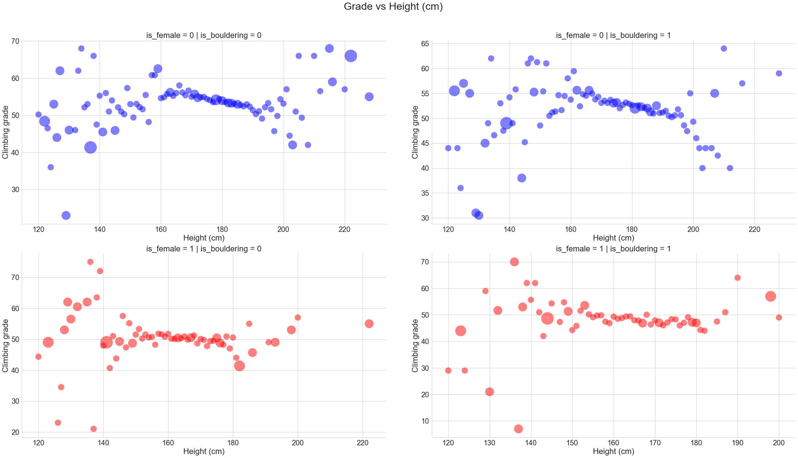

# 8a.nu Climber Analysis

**Please refer to the analysis report titled 'Report_climbing'. Note that there are three formats available: Jupyter Notebook (.ipynb), 
PDF (.pdf), and HTML (.html).**

This is a personal project to analyze rock climbing log data to look for statistically significant variables to climber success. Of particular interest is 
that of climber height. While it might initially seem like it would usually - if not always - be better to be tall when rock climbing, that is not 
necessarily the case. While tall climbers can indeed grab holds easiy that shorter folks might have to use more advanced technique to reach, they also
tend to have to crunch up into awkward positions when the good holds are spaced closer together.

Indeed, a simple plot of average climbing grade as a function of height (from the online climbing logbook www.8a.nu) shows that the height vs.
climbing grade trend is far from linear. Rather, there appears to be a sort of sweet spot as the plots are somewhat parabolic for both genders as well
as for bouldering and rope climbing.

## Synopsis
A large dataset scraped from the online rock climbing log www.8a.nu was analyzed using ordinary least squares regression to determine whether certain characteristics - specifically, a climbers height, weight, age, and years of experience - have a statistically significant influence on overall rock climbing ability. The dataset was cleaned and then organized to include the *maximum* climbing grade attained by each unique user on a scale of 0 to 82 (which corresponds to 0 to 9c+/10a in the commonly used Font rock climbing grade scale). 

It was found that height and weight are highly correlated and so weight was dropped as a predictor. Further, the data was broken out into four different cases - two for gender and two for climbing type (bouldering and rope climbing). A summary of the results is as follows:

* **Age is a statistically signficant predictor for all four cases and consistently shows a negative correlation with climbing ability. That is, for a linear regression model, climbing ability is negatively impacted by age.**

* **Height is not a statistically significant predictor for females but is a negative predictor for males in both bouldering and rope climbing. That is, for a linear regression model, a male's climbing ability is negatively impacted by height.**

* **Years of experience is a statistically significant predictor for all four cases and consistently shows a positive correlation with climbing ability. That is, for a linear regression model, climbing ability is positively impacted by years of experience.**

## Data
The raw data was downloaded from: https://www.kaggle.com/dcohen21/8anu-climbing-logbook.

The data used was scraped from https://beta.8a.nu/ by David Cohen (https://www.kaggle.com/dcohen21). It should be noted that the user's code to scrape
the website is no longer avaialable due to DMCA takedown.

Per the data description, it was collected on 2017-9-13. The data is assumed to be accurate.

## Goal
To determine if variables exist that give climbers a statistically significant advantage.

## Instructions
Not applicable. 